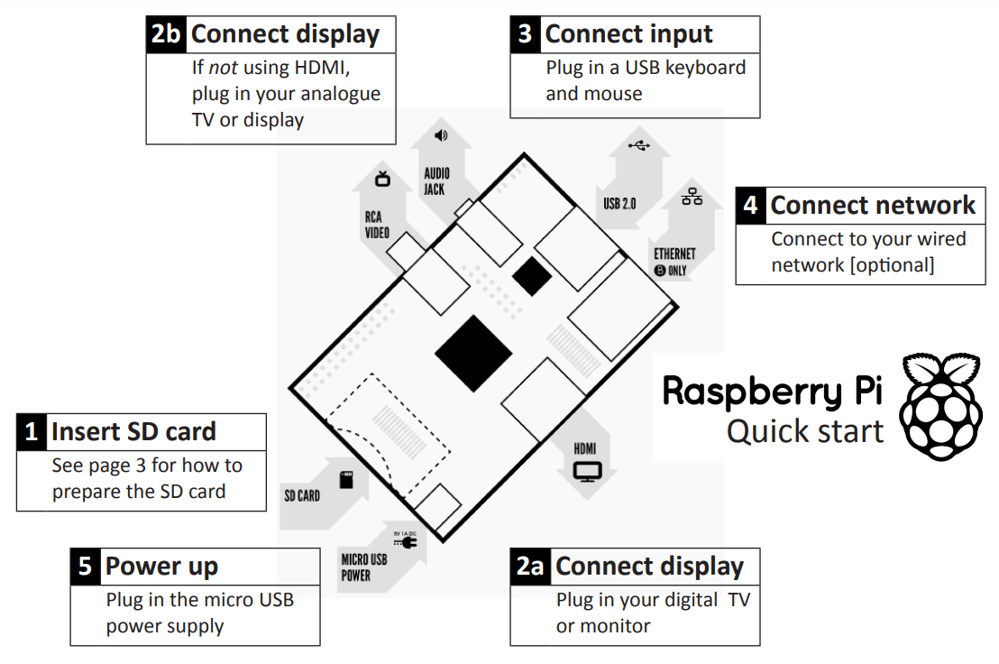
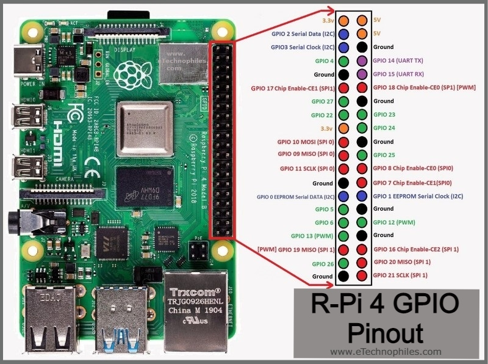
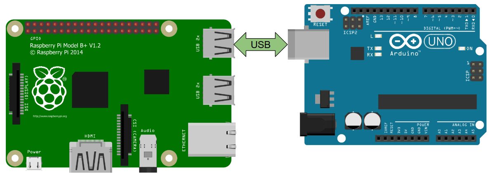
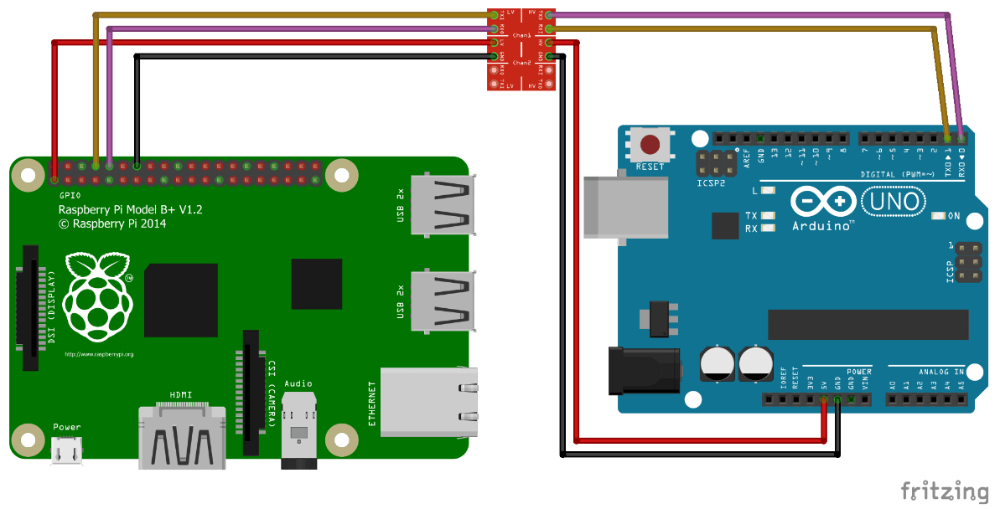

# Raspberry Pi Quick Start

## RaspberryPi 4 Model B

<br>

[Quick start with Raspberry pi](#quick-start)

[RPi pinout](#pinout)

[Virtual Environment](#how-to-create-and-activate-a-virtual-environment)

[Simple LED blink with RPi](#simple-led-blink-with-rpi)

[Connecting to Arduino](#connecting-raspberry-pi-to-arduino)

[Detecting Arduino port](#detecting-arduino-board)

[Hardware permission in RPi](#hardware-permission-for-serial-access)

[Simple communicate to Arduino code](#simple-communicate-to-arduino-communicate-to-Arduino)

[Send and receive data via Serial](#send-and-receive-data-via-serial-port)

---
<br>

#### Quick Start



<br>

### Pinout


Seconde Diagram: 



----

<br>

<h2><span style = "color : orange">Code BOX </span></h2>

<br>

## what is a virtual environment and why you are asked to create one for most codes? 

[You will find the answer HERE](https://realpython.com/python-virtual-environments-a-primer/#activate-it)

<br>

## How to create and activate a virtual environment

<span style = "color : yellow"> <b> Create<b> </span>

```Shell
$ python3 -m venv venv-name
```
<span style = "color : yellow"> <b> Activate<b> </span>

```Shell
$ source venv-name/bin/activate
(venv-name) $
```

## Install pakages in the virtual Environment 

```Shell
(venv-name) $ python -m pip install <package-name>
```

**When you're done with the environment you'd better to diactivate it**

```Shell
(venv-name) $ deactivate
$
```

<span style = "color : red">
<b><em>NOTE:</em><b> If you want to get back to the created environment, <span style = "color : yellow">  just Return up to the <b>ACTIVATED<b> section. </span> 
</span>

<br>

## Simple LED blink with RPi

<details><summary>install RPi.GPIO</summary>
<p>

***NOTE:*** install this module in virtual environment.
```
pip install RPi.GPIO
```

<br>

</p>
</details>

<br>

```py
 # Simple LED blink...

import RPi.GPIO as GPIO  
import time

led_pin = 23

GPIO.setmode(GPIO.BCM)
GPIO.setup(led_pin, GPIO.OUT)

blink_repeat = int(input("blink repeats >> "))

while(blink_repeat>0)
    GPIO.output(led_pin, GPIO.HIGH)
    time.sleep(1)
    GPIO.output(led_pin, GPIO.LOW)
    time.sleep(1)

    blink_repeat -= 1
```

<br>

<details><summary> what is BCM in GPIO.setmode(GPIO.BCM) </summary>
<p>
There are two kinds of Input and Output pin numbering for the Raspberry pi. One is the BCM and the other is BOARD. Basically these pin numberings are useful for writing python script for the Raspberry Pi. 

<br>

**GPIO BOARD**– This type of pin numbering refers to the number of the pin in the plug, i.e, the numbers printed on the board, for example, P1. The advantage of this type of numbering is, it will not change even though the version of board changes.

**GPIO BCM**– The BCM option refers to the pin by “Broadcom SOC Channel. They signify the Broadcom SOC channel designation. The BCM channel changes as the version number changes.

**Broadcom SOC Channel**– BCM refers to the “Broadcom SOC channel” number, which is the numbering inside the chip which is used on the Raspberry Pi. These numbers changed between board versions as you can see in the previous tables for the 26-pin header type 1 versus 2, and or not sequential. 


***NOTE:***
The BCM numbers changed between versions of the Pi1 Model B, and you’ll need to work out which one you have guide here. So it may be safer to use the BOARD numbers if you are going to use more than one Raspberry Pi in a project.

<br>

In a nutshell, BCM pins maybe differ in raspberrypi's boards but Board pins are the same.

[Further details](https://iot4beginners.com/difference-between-bcm-and-board-pin-numbering-in-raspberry-pi/) 

<br>
</p>
</details>

<br>

## Connecting Raspberry pi to Arduino

You can simply send data via USB cable.

<br>

Or use GPIO pins.. BUT it's recommended to use USB port.

***NOTE:*** Raspbery pi operating at 3.3v, so if it's connected to Arduino a logic level converter should be used.

## Detecting Arduino Board:

```
$ ls /dev/tty*
```
<span style = "color:red">
<b><em>NOTE:</em></b> when Arduino is connected */dev/ttyACM0* or */dev/ttyUSB0* may appear in the list. BUT keep in mind that the number maybe different.
</span>

<br>

**To find ACM in the list of ports:**
```py
from os import system

print("Connected devices include 'ACM' are: ")
system("ls /dev/tty* | grep ACM")
```


# Hardware permission for Serial access
To avoid Errorssuch as ***serial.serialutil.SerialException: [Errno 13] could not open port /dev/ttyACM0: [Errno 13] Permission denied: ‘/dev/ttyACM0’*** run the following code block to make sure you have access to the port:

```Shell
$ sudo adduser your_username dialout
```
<span style="color:red">
Once you've been added the dialgroup you need to <b>REBOOT</b> &nbsp;your RPi or just logout nad login again to apply changes.
</span>

<br><br>

### Use ***pyserial*** to use Serial interface with Python 
<br>

<span style = "color : red"> <b><em>NOTE:</em><b> &nbsp; Do not forget to install the package in the <b> Virtual Environment </b> that you've created.


```Shell
$ python3 -m pip install pyserial
```
<br>
<span>
<br>

[Further information for RPi prmissions](https://roboticsbackend.com/raspberry-pi-hardware-permissions/)


## Simple communicate to Arduino
***Arduino code:***

```ino
void setup()
{
    Serial.begin(9600);
}

void loop()
{
    Serila.println("Hi to you");
    delay(500);
}
```
<br>

***RPi code:***
```py 
from os import system
import serial


def ReceivedData(port):
    ser = serial.Serial(port, 9600, timeout=1)
    ser.reset_input_buffer()
    while True:
        if ser.in_waiting > 0:
            line = ser.readline().decode('utf-8').rstrip()
            print(line)

system("ls /dev/tty* | grep ACM > command_output.txt")
with open ("./command_output.txt", 'r') as port_name:
    port = port_name.readline()
    # There is a '\n' at the end of the port that has to be removed
    port = port.strip()

if len(port)>0:
    arduino_port = port
    ReceivedData(arduino_port)
else:
    print("Error: No Device is connected")

```

***NOTE:*** &nbsp;if the error

`in open
    raise SerialException(msg.errno, "could not open port {}: {}".format(self._port, msg))
    serial.serialutil.SerialException: [Errno 13] could not open port /dev/ttyACM0: [Errno 13] Permission denied: '/dev/ttyACM0'` 

pops up, &nbsp;run the following code block


```Shell
$ sudo chmod 666 /dev/ttyACM0
```

<br>

[Further information](https://roboticsbackend.com/raspberry-pi-arduino-serial-communication/)


## Send and Receive data via Serial port

```py
from os import system
from serial import Serial
import time

validCommands = ['on','off']

def discoverConnectedPort():
    ## find 'ACM' in the list of ports and write it in a txt file
    system("ls /dev/tty* | grep ACM > command_output.txt")
    with open ("./command_output.txt", 'r') as grepOutputFile:
        portName = grepOutputFile.readline()
        # There is a '\n' at the end of the port that has to be removed
        portName = portName.strip()
        ## it returns a string like '/dev/ttyACM1'
        return portName

with Serial(port = discoverConnectedPort(), baudrate= 9600, timeout=1) as arduino:
    if arduino.isOpen():
        # split the port name string by / and create a list of it, print the last element of it
        # /dev/ttyACM1 -> ['dev', 'ttyACM1']   
        print("{} connected!".format(arduino.port.split(sep='/')[-1]))  
        while True:
            command = input("your command >> ")
            if (command == 'exit'):
                exit()
            
            time.sleep(0.1) #wait for serial to open  
            # Encode the command to utf-8
            arduino.write(command.encode())

            if command in validCommands:
                # wait until something is in the buffer
                while arduino.inWaiting()==0: pass
                # if there is more that 0 byte in the buffer, read it
                if (arduino.inWaiting() > 0):
                    # There is a '\n' at the end of the message that has to be removed
                    message = arduino.readline().decode('utf-8').rstrip()
                    print(message)
                    # reset input buffer
                    arduino.flushInput()
```
[Further information](https://pyserial.readthedocs.io/en/latest/pyserial_api.html)